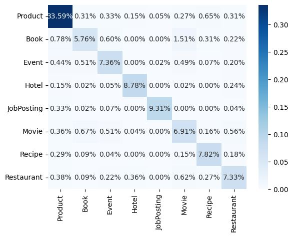
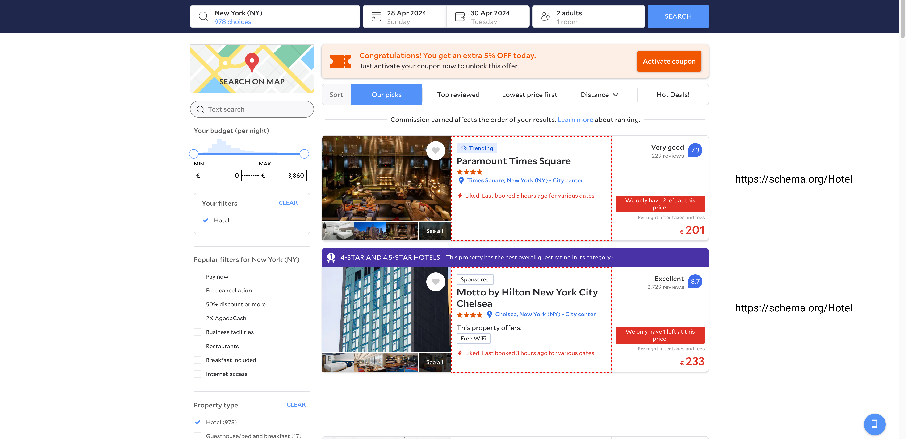

<a name="readme-top"></a>

# Annotate With Microdata

## Table of contents
- [About the project](#about-the-project-)
- [Getting started](#getting-started-)
  - [Prerequisites](#prerequisites-)
  - [Installation](#installation-)
- [Usage](#usage-)
- [Examples](#examples-)
- [Roadmap](#roadmap-)
- [Contributing](#contributing-)
- [License](#license-)
- [Contact](#contact-)
- [Acknowledgments](#acknowledgments-)

## About the project [📌](#about-the-project-)

This project aims to provide a simple way to annotate HTML with microdata by utilizing *Deep Learning* methods.

The main motivation behind this project is to manage the tedious task of annotating HTML with microdata. Microdata is part of the WHATWG HTML Standard and is used to nest metadata within existing content on web pages. Search engines greatly benefit from microdata and boost web pages in search results.

This project is made as part of thesis work in Institute of Information Technologies and Intelligent Systems for a bachelor's degree

<p align="right">(<a href="#readme-top">back to top</a>)</p>

## Getting started [📌](#getting-started-)

### Prerequisites [📌](#prerequisites-)

- Python == 3.7
- pip 24.0+
- python3-virtualenv if running Linux

### Installation [📌](#installation-)

- Clone repository
  ```shell
  git clone git@github.com:i-timur/annotate-with-microdata.git
  ```
- Setup virtual environment
  - MacOS
    ```shell
    python3 -m venv venv
    source venv/bin/activate
    ```
  - Windows
    ```shell
    python3 -m venv venv
    .\venv\Scripts\activate
    ```
  - Linux
    ```shell
    virtualenv venv
    source venv/bin/activate
    ```
- Install dependencies
  ```shell
  pip install -r requirements.txt
  ```
- Install [this package](https://github.com/i-timur/learnhtml)
- Install the package globally
  ```shell
  pip install -e .
  ```

<p align="right">(<a href="#readme-top">back to top</a>)</p>

## Usage [📌](#usage-)

### Annotate HTML with microdata

HTML used for commands below requires the following minimal structure:

```html
<!DOCTYPE html>
<html>
  <head>
    <meta charset="utf-8">
    <title>Page Title</title>
  </head>
  <body>
    <!-- Content -->
  </body>
```

Annotate HTML by passing a URL to the shell command:

```shell
microdata annotate https://example.com
```

or by passing a path to the file with HTML:

```shell
microdata annotate ./path/to/file.html
```

***IMPORTANT:*** *DO NOT* format HTML, when saving it to a file, pass it *as is*.

or by passing HTML directly to the shell command *(NOT RECOMMENDED)*:

```shell
microdata annotate <HTML>
```

***IMPORTANT:*** *DO NOT* format HTML, when passing it directly to the shell command, pass it *as is*.

Set output file with `--output` option:

```shell
microdata annotate ./path/to/file.html --output ./path/to/annotated_file.html
```

Use `--skip <CLASS>,<OTHER_CLASS>` option to skip items that are related to the specified classes:

```shell
microdata annotate ./path/to/file.html --skip Product,Book
```

Various texts may have similar semantic meanings, so for situations where the user already knows 
that certain classes have a high level of semantic similarity with other classes, 
or when the classification of a specific class is not required for other reasons, use this flag.

The confusion matrix below can give you the insight of the usage of this flag:



The model can misclassify a lot of entities as products.
You can also see that the model struggles with choosing between the book and movie entities.
This flag can help to avoid this issue.

You can set confidence threshold with `--threshold` option (*NOT RECOMMENDED*). The default value is 0.75.

You can also pass `--save-preprocessed` flag to save the preprocessed HTML to a file.

Following entities are currently supported:

- [X] Product
- [X] Book
- [X] Event
- [X] Hotel
- [X] JobPosting
- [X] Movie
- [X] Recipe
- [X] Restaurant
- [ ] Organization
- [ ] Place
- [ ] Person
- [ ] PostalAddress
- [ ] Creative Work
- [ ] LocalBusiness
- [ ] Painting

## Examples [📌](#examples-)



## Roadmap [📌](#roadmap-)

- [ ] Add HTML validation

See the [open issues](https://github.com/i-timur/annotate-with-microdata/issues) for a full list of proposed features (and known issues).

<p align="right">(<a href="#readme-top">back to top</a>)</p>

## Contributing [📌](#contributing-)

Contributions are what make the open source community such an amazing place to learn, inspire, and create. Any contributions you make are **greatly appreciated**.

If you have a suggestion that would make this better, please fork the repo and create a pull request. You can also simply open an issue with the tag "enhancement".
Don't forget to give the project a star! Thanks again!

1. Fork the Project
2. Create your Feature Branch (`git checkout -b feature/AmazingFeature`)
3. Commit your Changes (`git commit -m 'Add some AmazingFeature'`)
4. Push to the Branch (`git push origin feature/AmazingFeature`)
5. Open a Pull Request

<p align="right">(<a href="#readme-top">back to top</a>)</p>

## License [📌](#license-)

Distributed under the MIT License. See `LICENSE.txt` for more information.

<p align="right">(<a href="#readme-top">back to top</a>)</p>

## Contact [📌](#contact-)

Timur - [i.timur0701@gmail.com](mailto:i.timur0701@gmail.com)

Project Link: [https://github.com/i-timur/AnnotateWithMicrodata](https://github.com/i-timur/AnnotateWithMicrodata)

<p align="right">(<a href="#readme-top">back to top</a>)</p>

## Acknowledgments [📌](#acknowledgments-)

- [web-segment](https://github.com/liaocyintl/web-segment)
- [bert-multilingual](https://github.com/google-research/bert/blob/master/multilingual.md)
- [learnhtml](https://github.com/nikitautiu/learnhtml)
- [Best-README-Template](https://github.com/othneildrew/Best-README-Template)

<p align="right">(<a href="#readme-top">back to top</a>)</p>
